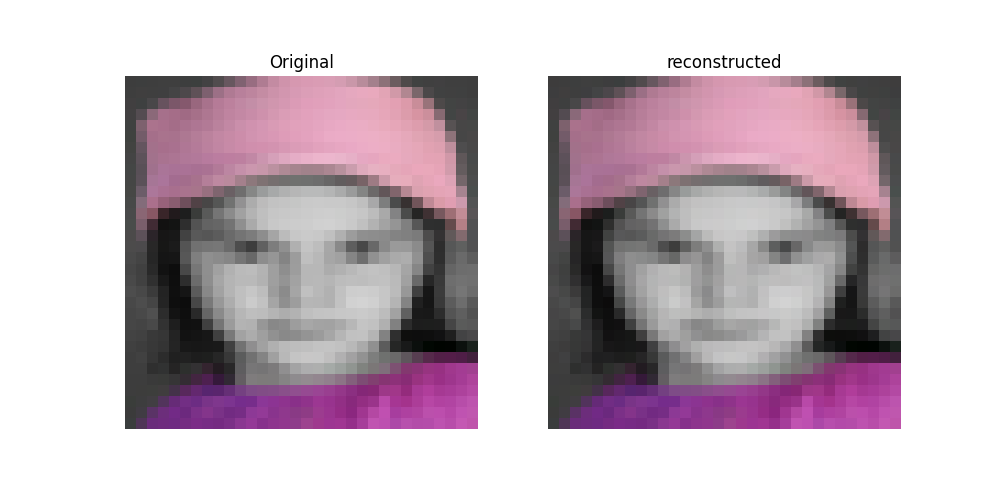

## Project Title
R-CONV: An Analytical Approach for Efficient Data
Reconstruction via Convolutional Gradients
## Citation
If you find our work useful please give credit to the related published paper:
Eltaras, T.A., Malluhi, Q., Savino, A., Carlo, S.D., Qayyum, A. (2025). R-CONV: An Analytical Approach for Efficient Data Reconstruction via Convolutional Gradients. In: Barhamgi, M., Wang, H., Wang, X. (eds) Web Information Systems Engineering – WISE 2024. WISE 2024. Lecture Notes in Computer Science, vol 15440. Springer, Singapore. https://doi.org/10.1007/978-981-96-0576-7_21

```
@InProceedings{10.1007/978-981-96-0576-7_21,
author="Eltaras, Tamer Ahmed
and Malluhi, Qutaibah
and Savino, Alessandro
and Carlo, Stefano Di
and Qayyum, Adnan",
editor="Barhamgi, Mahmoud
and Wang, Hua
and Wang, Xin",
title="R-CONV: An Analytical Approach for Efficient Data Reconstruction via Convolutional Gradients",
booktitle="Web Information Systems Engineering -- WISE 2024",
year="2025",
publisher="Springer Nature Singapore",
address="Singapore",
pages="271--285",
isbn="978-981-96-0576-7"
}
```
## Fundings
This study is partially supported by:
* the “COLTRANE-V” project - funded by the Ministero dell’Universit` a e della Ricerca within the PRIN 2022 program (D.D.104 - 02/02/2022).
* SERICS project (PE00000014) under the MUR National Recovery and Resilience Plan funded by the European Union - NextGenerationEU.
This work reflects only the authors’ views and opinions, and the funding bodies cannot be considered responsible for them.

## Description
This project contains our paper's code implementations and experiments on advanced gradient-based data leakage methods on convolutional layers. <br>

Our research introduces an advanced data leakage method that efficiently exploits gradients from convolutional layers. We present a surprising finding: even with non-fully invertible activation functions such as ReLU, we can analytically reconstruct training samples from the gradients. To the best of our knowledge, this is the first analytical approach that successfully reconstructs convolutional layer inputs directly from the gradients, bypassing the need to reconstruct layers' outputs.

Unlike previous research, which underestimated the significance of gradient constraints in convolutional layers, our findings reveal their crucial importance. Our findings advance the understanding of gradient leakage by demonstrating the substantial value of gradient constraints. By leveraging these constraints, our method reconstructs training data more effectively, in less time, and with fewer parameters than other approaches. Additionally, our method can be applied in the presence of a wide range of activation functions.
## Methodology

Given that typical networks use convolutional layers followed by fully connected (FC) layers, we start by constructing the first fully connected layer.
1. **Reconstructing FC Layer Input**:
    - We reconstruct the input to the first FC layer as follows: for each point \( x_n \), we divide one of the corresponding gradient weights by the gradient bias for any connected node to this input:
    $x_n=\frac{\partial \ell}{\partial w_{nm}}/ \frac{\partial \ell}{\partial b_m}$
    - Additionally, we compute the gradient with respect to the input of the FC layer. For each point \( x_n \), we multiply the corresponding gradient bias by the corresponding weight for each connected node:
    $\frac{\partial \ell}{\partial x_n}=\frac{\partial \ell}{\partial b_m}\times w_{nm}$
    - We then sum all these gradients to get the final gradient with respect to this point:  
    $$\frac{\partial \ell}{\partial x_n}=\sum_{c=1}^{C}\frac{\partial \ell}{\partial x_n}$$
    - **Key Success Factor**:
        - The success of our approach hinges on using the reconstructed input to propagate the computed gradient through the activation function.
2. **Propagating Gradients**:
    - Common activation functions,(e.g. sigmoid, tanh, ReLU,LeakyReLU,...) have well-defined mathematical expressions for their derivatives. These derivatives can be efficiently calculated using the activation function's output value (the input that we have constructed).
    - Using the chain rule, we can construct the gradient with respect to the output of the previous layer (convolutional layer):
    $$\frac{\partial\ell}{\partial O}=\frac{\partial\ell}{\partial X}\times A’(O)$$
    - You can find a table of the derivatives of the most common activation functions provided in the paper.
3. **Reconstructing convloutinal Layer Input**:
    - Using the gradients w.r.t the output of the convolutional layer that we constructed, we can reconstruct the input of the layer using the weight gradients. Each weight gradient is a function of some input points and their corresponding output gradient points. for instant:  
    $$\frac{\partial \ell}{\partial w_{d,i}}=\frac{\partial \ell}{\partial o_{d,1}}\times x[r[1]] +\frac{\partial \ell}{\partial o_{d,2}}\times x[r[2]]+\dots+\frac{\partial \ell}{\partial o_{d,m}}\times x[r[m]]$$
    - If the layer has enough filters, we can construct a set of linear equations enabling the reconstruction of the input.
    - This process can be applied iteratively for all layers until we reconstruct the input of the first layer.  
    
This methodology highlights the innovative steps we take to leverage gradient information and activation functions to reconstruct inputs in convolutional layers, significantly enhancing the effectiveness of gradient-based data leakage attacks.
## Notebooks and Google Colab
We provide [](https://colab.research.google.com/drive/1R2wF_WJHqcjf4DB2DYq2glg1TCTaHJ1f?usp=sharing) for quick reproduction.

- Under the folders **Various_settings**, and **Testing** you can find ready-to-use notebooks for quick testing as well as the results from our previous runs.


## Usage
You can run the script through:
```bash
python main.py 
```
**Options**  

-d : Choose between three datasets. Options are ["CIFAR10","MNIST","CIFAR100"].<br>
-i : Choose the image index.<br>
-a : Choose the type of activation function. Options are:["ReLU","LeakyReLU","Sigmoid","Tanh"].  

**Example**<br>
Here’s an example command to run the script with the CIFAR100 dataset, using image index 92 and the ReLU activation function
```bash
python main.py -d CIFAR100 -i 92 -a ReLU
```

## Network Architectures
Under the folder **Various_setting** you can find different notebooks for various network architectures available in the repository.<br>
1. **LetNet**: The architecture that has been used in DLG.<br>
2. **LetNet_O**: An optimized version of LetNet, demonstrating that even using fewer filters we can reconstruct the images using gradient constraints.<br>
3. **O_CNN6**: The architecture that has been used in R-GAP, demonstrating that with only 3 filters at the last layer, we can reconstruct the image instead of using 128 filters as demonstrated in R-GAP.<br>
4. **LetNet-4-Relu**: The architecture of LetNet using the ReLU function between the four convolution layers.<br>
5. **LetNet-All-Relu**: The architecture of LetNet using the ReLU function between all the layers except the output layer. By using ReLU in the first layer, it requires a much larger number of filters as the gradient constraints are less in the first layer where the input channels are only 3.<br>

## Testing

Under the folder **Testing** you can find three different notebooks. Each notebook runs the script over the first 100 images of a specific dataset.

### Notebooks

1. **Test_on_MNIST**: This notebook runs the script over the first 100 images of the MNIST dataset.
2. **Test_on_CIFAR10**: This notebook runs the script over the first 100 images of the CIFAR10 dataset.
3. **Test_on_CIFAR100**: This notebook runs the script over the first 100 images of the CIFAR100 dataset.

Each notebook is designed to automate the process of running the script on the respective dataset, providing results and insights based on the first 100 images.
